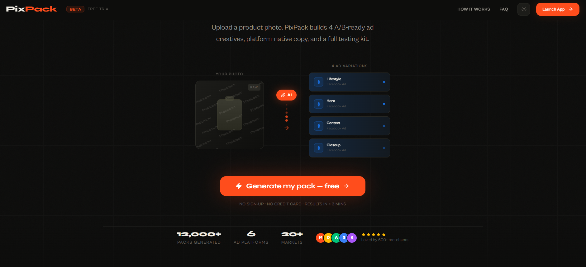

# PixPack 🚀

**PixPack** is an open-source, AI-powered ad creative automation tool. Designed for e-commerce marketers, it turns a single product photo into 4 platform-ready A/B testing ad variations with compelling, psychologically-driven copy in under 90 seconds.

Stop wrestling with complex prompts and graphic design tools. Upload a photo, pick your audience, and get ready-to-test assets.

<div align="center">
  
</div>

## 🌟 The Magic (Why PixPack?)

Instead of randomly generating "cool images", PixPack operates like an automated ad agency. It executes a strategic workflow:
1. **The Creative Director Agent**: Designs 4 specific creative angles (Lifestyle, Hero, Context, Closeup) tailored to your product.
2. **The Copywriter Agent**: Drafts 3 distinct ad copy variants (Awareness, Consideration, Conversion) mapped to core psychological drivers (Security, Belonging, Status, Freedom, Curiosity).
3. **The Studio Agent**: Renders high-resolution photography inserting your product seamlessly into the newly designed environments.

## 🏗️ Architecture & Data Flow

PixPack is built to be resilient and responsive. It offloads heavy AI orchestration to background workers to bypass serverless timeouts while streaming real-time progress to the client.

### Request Lifecycle

1. **Pre-Analysis (`/api/analyze`)**
   - The user's uploaded image is passed to **Photoroom API** to perfectly extract the subject and remove the background.
   - **Gemini 2.5 Flash** (Vision) analyzes the extracted subject to build a detailed `ProductProfile` (identifying colors, materials, lighting, and product type).
2. **Configuration**
   - User inputs specific hints (e.g., "Handmade in Morocco"), selects an audience demographic, and chooses a platform (Instagram, TikTok, etc.).
3. **Generation Queue (`/api/generate`)**
   - A task payload is sent to **Trigger.dev**, which handles background execution and guarantees completion, circumventing standard 60s Vercel limits.
   - The frontend connects to a real-time stream using `@trigger.dev/react-hooks` to display progression and progressive image loading.
4. **The Pipeline (`generate-pack` task)**
   - **Stage 1 (Creative)**: Gemini creates 4 JSON scene descriptions based on the `ProductProfile`.
   - **Stage 2 (Copy)**: Gemini generates conversion-optimized ad copy tailored to the target platform rules.
   - **Stage 3 (Render)**: **Gemini 2.5 Flash Image** generates the environments sequentially.
   - Each completed image string is uploaded directly to **Supabase Storage**. The public URL is appended to the streaming Trigger.dev run metadata.
5. **Fulfillment (`/api/request-download` & `/api/download`)**
   - After previewing the pack, the user requests a download.
   - An email is dispatched via **Resend** containing a JWT-signed, expiring download link.
   - The `/api/download` route verifies the token, securely fetches the images from Supabase, zips them alongside text files containing the ad copy using `jszip`, and streams the ZIP file directly to the user.

## 🛠️ Tech Stack

- **Framework**: [Next.js App Router](https://nextjs.org/) (TypeScript, React 19)
- **Styling**: Tailwind CSS + shadcn/ui
- **Animations**: Framer Motion
- **Background Orchestration**: [Trigger.dev](https://trigger.dev/) (v3/v4 Realtime)
- **AI Models**: Google GenAI SDK (`gemini-2.5-flash`, `gemini-2.5-flash-image`)
- **Image Editing**: Photoroom API
- **Storage**: Supabase (Postgres & Storage)
- **Email Delivery**: Resend & React Email

## 📂 Project Structure

```text
pixpack/
├── app/                  # Next.js App Router endpoints & pages
│   └── api/              # Serverless route handlers (analyze, generate, download)
├── components/           # React component library
│   ├── generation/       # UI for loaders, queue, and generation states
│   ├── layout/           # Sidebar, navigation, layout scaffolding
│   └── output/           # Rendered outputs, interactive image cards, pack grids
├── hooks/                # Local custom hooks and Zustand state (useGenerationStore)
├── lib/                  # Core application logic
│   ├── prompts/          # Highly optimized system prompts for Gemini
│   └── services/         # Integrations (API wrappers, email routing)
└── trigger/              # Trigger.dev background task definitions
```

## 🚀 Getting Started

### Prerequisites
You will need API keys and service accounts for the following services:
- [Google Cloud Platform](https://console.cloud.google.com/) (Vertex AI enabled, Service Account JSON key)
- [Trigger.dev](https://trigger.dev/) (Project Key)
- [Supabase](https://supabase.com/) (Project URL, Anon Key & Service Role Key)
- [Photoroom](https://www.photoroom.com/) (API Key)
- [Resend](https://resend.com/) (API Key)

### Local Development

1. **Clone the repository:**
   ```bash
   git clone https://github.com/devbossma/pixpack.git
   cd pixpack
   ```

2. **Install dependencies:**
   ```bash
   npm install
   ```

3. **Configure Environment Variables:**
   Copy `.env.example` to `.env.local` and fill in the required keys:
   ```env
   # Google Cloud Settings (Vertex AI)
   GOOGLE_CLOUD_PROJECT_ID=your-gcp-project-id
   GOOGLE_CLOUD_LOCATION=us-central1
   GOOGLE_APPLICATION_CREDENTIALS=./service-account.json

   # Trigger.dev Keys
   TRIGGER_SECRET_KEY=tr_prd_....
   NEXT_PUBLIC_TRIGGER_PUBLIC_KEY=pk_prd_....

   # Supabase Storage Details
   NEXT_PUBLIC_SUPABASE_URL=your_supabase_url
   NEXT_PUBLIC_SUPABASE_PUBLISHABLE_DEFAULT_KEY=your_supabase_anon_key
   SUPABASE_SERVICE_ROLE_KEY=your_supabase_service_key

   # Image Extractor
   PHOTOROOM_API_KEY=your_photoroom_key

   # Email Gateway
   RESEND_API_KEY=your_resend_key
   RESEND_FROM_DOMAIN=your_verified_domain

   # Security
   DOWNLOAD_SECRET=random-32-byte-string
   ```

4. **Start the Development Server:**
   ```bash
   npm run dev
   ```
   *Note: If you are running Trigger.dev tasks locally, ensure you also run the Trigger CLI in a separate terminal: `npx trigger.dev@latest dev`*

## 🤝 Contributing

Contributions are welcome! Whether it's adding a new platform size, tuning prompt instructions, or squashing bugs.

1. Fork the Project
2. Create your Feature Branch (`git checkout -b feature/AmazingFeature`)
3. Commit your Changes (`git commit -m 'Add some AmazingFeature'`)
4. Push to the Branch (`git push origin feature/AmazingFeature`)
5. Open a Pull Request

## 📄 License

Distributed under the MIT License. See `LICENSE` for more information.

